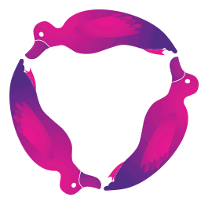

[](https://gitter.im/redux-observable/redux-observable?utm_source=badge&utm_medium=badge&utm_campaign=pr-badge&utm_content=badge)
[](https://travis-ci.org/redux-observable/redux-observable)
[](https://www.npmjs.com/package/redux-observable)
[](https://www.npmjs.com/package/redux-observable)

[RxJS](http://github.com/ReactiveX/RxJS)-based middleware for
[Redux](http://github.com/reactjs/redux). Compose and cancel async actions to create side effects and more.

[https://redux-observable.js.org](https://redux-observable.js.org)

> Note: this project is quite stable, but is currently in maintenance mode. Critical fixes will still be released, but for now no additional features or changes will be considered as the maintainer [@jayphelps](https://github.com/jayphelps) is not actively working on any apps that use redux-observable (or any UI apps at all, actually.) If you would like to become a maintainer, please reach out to [@jayphelps](https://github.com/jayphelps). There is some [ongoing discussion](https://github.com/redux-observable/redux-observable/issues/738) around a potential 2.0.0 release (based on the current alpha) if you'd like to join in.

## Install

This has peer dependencies of `rxjs@6.x.x` and `redux@4.x.x`, which will have to be installed as well.

```bash
npm install --save redux-observable
```

> Note: current stable version `redux-observable` doesn't work with `rxjs@7.x.x`, it works with `rxjs@6.x.x`. If you still want to use `rxjs@7.x.x`, upgrade to `redux-observable@2.0.0-rc.2`.

##### UMD

We publish a UMD build inside our npm package. You can use it via the [unpkg](https://unpkg.com/) CDN:

[https://unpkg.com/redux-observable@latest/dist/redux-observable.min.js](https://unpkg.com/redux-observable@latest/dist/redux-observable.min.js)

## Watch an introduction

[](https://www.youtube.com/watch?v=AslncyG8whg)

## Documentation

### [https://redux-observable.js.org](https://redux-observable.js.org)

## Discuss

[](https://gitter.im/redux-observable/redux-observable?utm_source=badge&utm_medium=badge&utm_campaign=pr-badge&utm_content=badge)

Everyone is welcome on our [Gitter channel](https://gitter.im/redux-observable/redux-observable?utm_source=badge&utm_medium=badge&utm_campaign=pr-badge&utm_content=badge)!

## Custom Emoji

##### Save this:


Add the redux-observable spinning logo to your Slack channel! [Slack Instructions](https://get.slack.help/hc/en-us/articles/206870177-Create-custom-emoji)

***

*redux-observable is a community-driven, entirely volunteer project and is not officially affiliated with or sponsored by any company.

:shipit:
