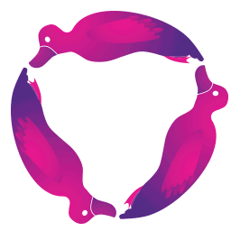

[RxJS](http://github.com/ReactiveX/RxJS)-based middleware for
[Redux](http://github.com/reactjs/redux). Compose and cancel async actions to create side effects and more.

[https://redux-observable.js.org](https://redux-observable.js.org)